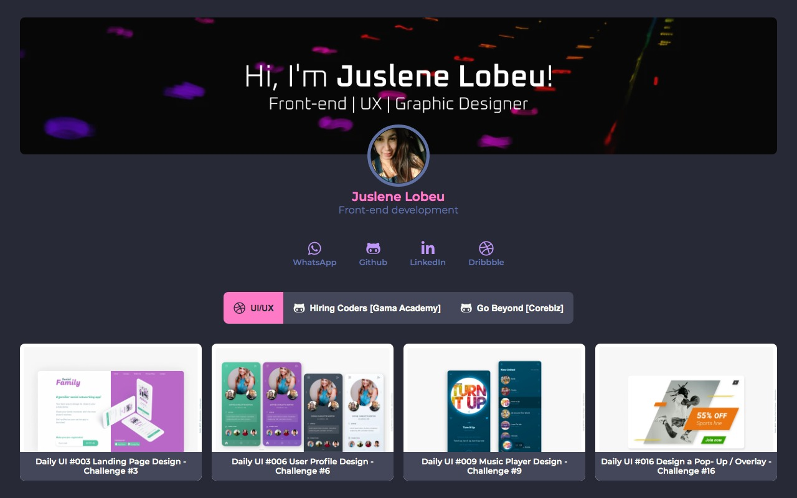

 

<h3 align="center">Desafio 03 - Go Beyond | Corebiz</h3>

---

## 👀 Preview

## 📝 Table of Contents

- [About](#about)
- [Features](#features)
- [Deployment](#deployment)
- [Authors](#authors)

## 🧐 About 

Criar uma homepage de portfolio com base no layout apresentado pelo mentor [Miguel Rosa](https://github.com/miguel-rosa) no [XD](https://xd.adobe.com/view/37061811-e3ad-4675-8ef5-d94bd7f2d4d6-6255/screen/e7c84a8a-2e81-45fd-91bd-1688c5be908b/specs/) e [link vercel](https://gobeyond.vercel.app/).

### ✅ I learned

Foi muito bacana fazer esse desafio, pois consegui criar da forma como eu desejava, utilizando **TypeScript** no **React**, assim pude estudar um pouco mais sobre as tipagens e suas aplicações nas `props`. Também, para esse desafio, foi utilizado com uma forma bem interessante de buscar dados para serem percorridos e exibidos conforme a necessidade do `componente`.

No **CSS** eu pude abusar um pouco mais de animações e efeito de `:hover` para deixar o visual mais interessante e interativo.

## ✨ Features 

- [x] Dados percorridos e exibidos no site com base em um array de nome `data` localizado em `./src/data/data.tsx`.
- [x] Listagem de dados de contato aom a inclusão de ícones de referência 
- [x] Menu tab listando conteúdo com base em sua referência, buscada do arquivo `data` e exibido através da utilização do método `.map()`
- [x] Listagem de card contendo uma imagem preview, título e link para acessar o conteúdo descrito.

## 🚀 Deployment 

Link Github Pages: [preview](https://juslenelobeu.github.io/corebiz-gobeyond-desafio-02/)

## ⛏️ Built Using 

- [React](https://pt-br.reactjs.org/) - Library
- [TypeScript](https://www.typescriptlang.org/pt/) - Types
- [Sass](https://sass-lang.com/) - Styles
- [Font Awesome](https://fontawesome.com/) - Ícones

## ✍️ Authors 
<a href="https://juslenelobeudesigner.com.br/">
  
   
  <b>Juslene Lobeu</b>👩🏻‍💻
</a>

Feito com&ensp;❤️&ensp;por Juslene Lobeu&ensp;👋🏽&ensp;Entre em contato!

 
 

